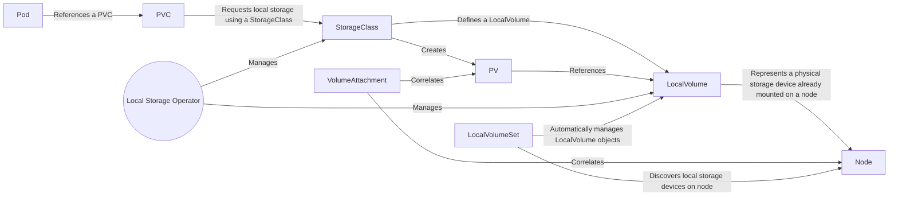

# local-storage-operator
Operator for local storage

## Deploying with OLM
Instructions to deploy on OCP >= 4.2 using OLM can be found [here](docs/deploy-with-olm.md)

## Using the must-gather image with the local storage operator
Instructions for using the local storage's must-gather image can be found [here](docs/must-gather.md)
